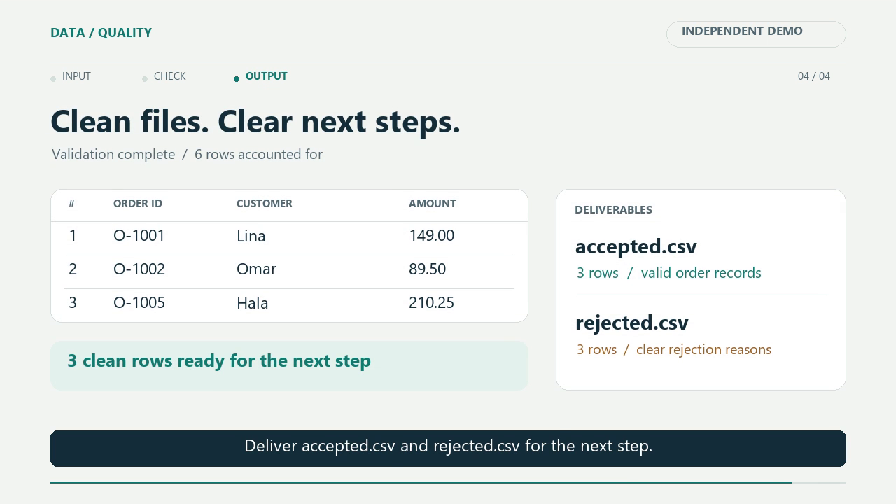

# CSV workflow: independent motion graphics sample

[Watch or download the 22-second MP4](https://raw.githubusercontent.com/ikoomm/services/main/samples/csv-motion-demo/demo.mp4)

An original silent technical explainer: animated layouts, row scanning, validation highlights and timed on-screen captions. Six fictional CSV records pass through a real Python validator, producing three accepted rows and three rejected rows with reasons.

**Created:** 20 September 2026. **Export:** 1280 × 720, 24 fps, H.264 MP4, 22 seconds. All 528 frames decoded successfully. Representative exported frames were inspected for readability and consistency.

This is an independent demonstration, not paid client work. It shows simple motion graphics and a technical workflow; it is not a testimonial edit, speech-synchronization sample or character-animation reel. No external footage, music, stock media or client information is included. Editable source uses Python and Pillow, with FFmpeg export.
