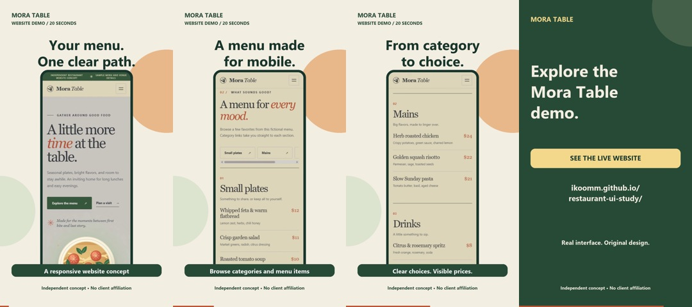

# Mora Table: a 20-second website product demo

Original independent portfolio experiment by Hazim Alsalmi. This promotes a fictional restaurant website concept, not a real restaurant, client campaign or measured commercial result.

[Watch/download hook A](mora-product-ad-hook-A.mp4?raw=true) · [Watch/download hook B](mora-product-ad-hook-B.mp4?raw=true) · [Live website](https://ikoomm.github.io/restaurant-ui-study/) · [Website source](https://github.com/ikoomm/restaurant-ui-study)

## What this demonstrates

- Actual mobile UI captures of our existing site: homepage, menu and category navigation. No invented application features, stock presenter or fabricated testimonial.
- 20 seconds, vertical 1080 × 1920, H.264 / AAC, 24 fps. On-screen text communicates without sound.
- Two opening hooks. After four seconds the content, timing, audio and call to action are identical, so a future buyer can compare one variable.
- Editable Python/Pillow composition and original synthesized tonal cues, encoded using the existing FFmpeg installation. No face, hands, voice recording, third-party music, paid API or GPU job.

Hook A: “Your menu. One clear path.” Hook B: “Less hunting. More browsing.” Neither has been tested with a live audience; no winner or conversion result is claimed.

## Small paid service test

**$25 pilot** (one-time 50% reduction from the normal intended $50 quote): one 20-second vertical product clip, two opening hooks using the same body, readable captions and one revision. One agreed feature, up to three supplied screens or a browser-accessible demo. Two business days after complete materials and scope agreement.

You receive both MP4 versions and the editable Python composition. Acceptance: agreed feature/copy shown accurately, export opens at 1080 × 1920, text readable and no unlicensed assets. AI avatar, voiceover, filming, paid stock, 3D and After Effects/Premiere source are excluded. Native-app footage must be supplied if a usable browser demo is unavailable. Confirm this source format before commissioning.

**Next step:** send the feature, demo link or recording, required format and deadline in our existing conversation. Marketplace inquiries, contracts and payments stay on the originating platform. No payment or public client data is requested through this sample.

## Rights and verification

UI belongs to the independent Mora Table concept. The site's visible sample prices/venue details are fictional. Audio is programmatically synthesized; no cloned voice or copyrighted recording. System fonts are used for rendered output; font binaries and FFmpeg binaries are not redistributed.

Both exports passed complete FFmpeg decode and stream checks. Representative frames were visually inspected; full-speed human playback and buyer acceptance have not been established. No revenue or client endorsement is claimed. See local `export-verification.json` for render time, hashes and export facts.

Rebuild locally with installed Python/Pillow and FFmpeg: `python render_ad.py`. The script writes derived files in its own folder, uses two encoding threads, and makes no network calls. Source captures are included. This sample adds a vertical product-ad format; it does not replace or mislabel the older horizontal CSV workflow video.
