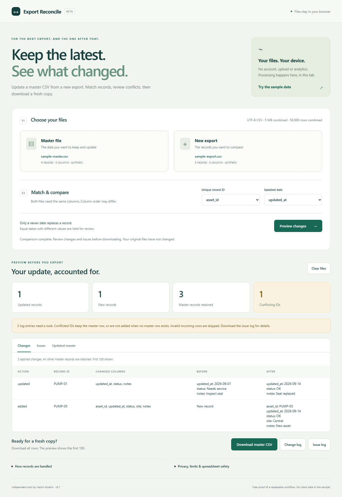

# Export Reconcile

Update a master CSV from a recurring export, keeping the newest record for each ID. Review changes and conflicts before downloading the result.

Free, open-source, and offline. An independent demonstration by Hazim Alsalmi, using synthetic sample data.

## Try it in your browser

**[Open Export Reconcile](https://ikoomm.github.io/services/)**, then choose **Try the sample data**. No account or installation is needed. Files are processed in your browser; their contents are not uploaded. For use without an internet connection, download the standalone app below.

## Use the standalone app

1. Download **[Export-Reconcile.html](Export-Reconcile.html)**. On GitHub, open the file and choose **Download raw file**; do not save the repository's file-preview page.
2. Open the downloaded HTML file in a modern browser. No installation, server, account, or internet connection is needed to process files.
3. Choose **Try the sample data**, or select your master CSV and new export.
4. Select the record-ID and updated-date columns, then choose **Preview changes**.
5. Review **Changes**, **Issues**, and **Updated master**. Download the master CSV, change log, and issue log as needed. The table previews show the first 100 rows; downloads include the full result.

Your original files are not overwritten. Keep copies and inspect the exported files before using them in another workflow.

## Supported inputs

- Two comma-separated, UTF-8 CSV files with one header row and the same exact column names. Column order may differ.
- Up to **5 MB and 50,000 data rows combined** across both files.
- One exact, case-sensitive ID column. `001` and `1` are different IDs; surrounding spaces are significant.
- One date column containing `YYYY-MM-DD` or ISO timestamps with `Z` or an explicit offset, such as `2026-09-29T14:30:00+03:00`. Date-only values mean midnight UTC.

Excel workbooks, semicolon-separated files, fuzzy matching, multiple matching keys, and large datasets are outside this demo.

## What happens to records

- New IDs are appended. Existing master records absent from the new export remain.
- A newer incoming record replaces the **whole master row, including blank values**. Older records do not replace newer ones.
- Repeated incoming IDs use the newest valid date. Different rows tied at the newest date are held for review. Equal master/incoming dates with different values also produce a conflict.
- A conflicted ID retains its master row, or is not added if no master row exists.
- Repeated master IDs stop the comparison. Master rows with missing IDs or invalid dates remain untouched; invalid incoming rows are skipped and logged.

The issue log identifies affected records and explains what was held or skipped. Record numbers include the header; a quoted multiline cell still belongs to one CSV record. Malformed CSV or incompatible headers stop processing instead of producing a partial result.

## Privacy and spreadsheet safety

Processing stays in the browser tab. The app makes no network requests and uses no accounts, analytics, or persistent storage. **Clear files**, reload, or close the tab to discard loaded data; downloaded files remain on your device.

Exports conservatively prefix formula-like cells and headers with an apostrophe. This includes values beginning with `=`, `+`, `@`, or `-`, even after leading whitespace/control characters. **Negative numbers are protected too**, so exported text may differ from the input. Check your downstream import rules, especially when protected IDs or headers will be reused in a later reconciliation.

## Optional custom setup — $25

Have a recurring export you want configured? The introductory quote is **$25**, a one-time 50% reduction from the $50 base quote, for:

- Two CSVs, up to **5,000 rows combined and 20 columns**, using one ID and one date rule.
- A review of the source-file structure and agreed matching rule.
- A configured standalone HTML workflow you can reuse, a checked first result with change/issue logs, and one short instruction guide.
- One revision within the agreed scope; delivery within **two business days after scope agreement and receipt of the required files**.

To check fit, send **five anonymized sample rows**, the column headers, and the ID/date columns you want to use to **[hamammalsalmy9@gmail.com](mailto:hamammalsalmy9@gmail.com)** or use **[Custom setup — $25 on Ko-fi](https://ko-fi.com/c/79e4c86823)** to review the service and contact Hazim before ordering. Do not send confidential data in a public comment. The free app remains available without buying the service.

## Source and license

`index.html`, `style.css`, `app.js`, and `core.js` are the editable sources. `Export-Reconcile.html` is the standalone bundle. After changing source files, run `python build.py` to regenerate it. Core checks can be run with `node --test core.test.cjs`.

Released under the [MIT License](LICENSE).
